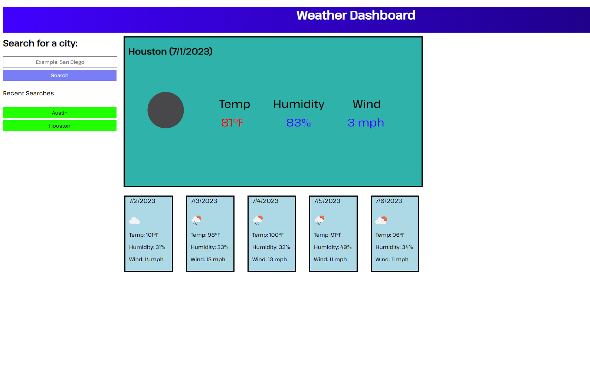

# 06 Server-Side APIs: Weather Dashboard

## The App

Using an OpenWeatherMap API, this web application allows the user to search for a city, displays the current weather up above, and a weather forecast for the next five days below. Each search is archived in a list on the left and clicking on a previous search will re-submit it.

In order for this to work, I also had to use their Geocoding API to gather the GPS coordinates of the city.

## User Story

```
AS A traveler
I WANT to see the weather outlook for multiple cities
SO THAT I can plan a trip accordingly
```

## Mock-Up

The following image shows the web application's appearance and functionality:



## Link

Repo: https://github.com/Coridane/weatherdashboard
Website: https://coridane.github.io/weatherdashboard